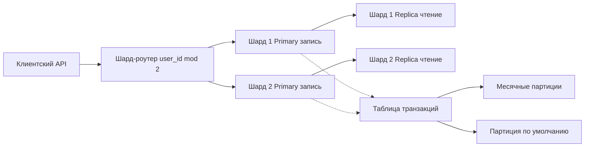

# Лабораторная работа 4

Проектирование БД для системы учета доходов и расходов:

- партиционирование таблицы транзакций по времени;
- шардирование пользователей по `user_id`;
- репликация `primary -> replica` в каждом шарде.

## Пояснение по выполнению задания

### 1. Проектирование БД

В модели выделены ключевые сущности предметной области:

- `users` — пользователь;
- `accounts` — счета пользователя;
- `categories` — категории доходов/расходов;
- `transactions` — финансовые операции;
- `daily_aggregates` — агрегаты для быстрых отчетов.

Связи проектируются как `1:N` от пользователя к счетам, категориям и транзакциям. Это покрывает базовые сценарии кошелька: хранение операций, фильтрация по периоду, построение сводной аналитики.

### 2. Партиционирование

Таблица наибольшего объема — `transactions`, поэтому она разделяется по времени (`RANGE` по дате). Выбраны месячные партиции.

Что это ускоряет:

- отчеты за конкретный месяц/квартал;
- выборки последних операций;
- архивирование старых данных без полного сканирования таблицы.

### 3. Шардирование

Выбран способ шардирования по `user_id`:

- ключ: `user_id`;
- алгоритм: `user_id mod N`;
- количество шардов в базовом проекте: `2`.

Данные одного пользователя хранятся в одном шарде. Это уменьшает межшардовые операции и упрощает транзакции в рамках пользователя.

### 4. Репликация

Для каждого шарда используется пара `primary + replica`:

- запись идет в `primary`;
- чтение отчетов и части API — из `replica`.

Поведение при сбоях:

- при отказе реплики система продолжает запись, но теряет часть read-мощности;
- при отказе primary требуется failover на replica и переключение роутинга.

### 5. Общая архитектура

Роутер принимает запрос, определяет целевой шард по `user_id`, направляет запись в `primary`, чтение — в `replica`. Внутри шарда таблица транзакций партиционируется по времени.

### 6. Анализ

- Шардирование по `user_id` выбрано из-за равномерности и предсказуемости маршрутизации.
- Партиционирование уменьшает объем читаемых данных и ускоряет time-range запросы.
- Основные риски: hot-shard, lag репликации, усложнение миграций.
- Масштабирование: увеличение числа шардов, добавление read-replica, балансировка API-слоя.

## Диаграмма Mermaid

Название: `Контейнерная диаграмма БД (шардинг + репликация + партиционирование)`

