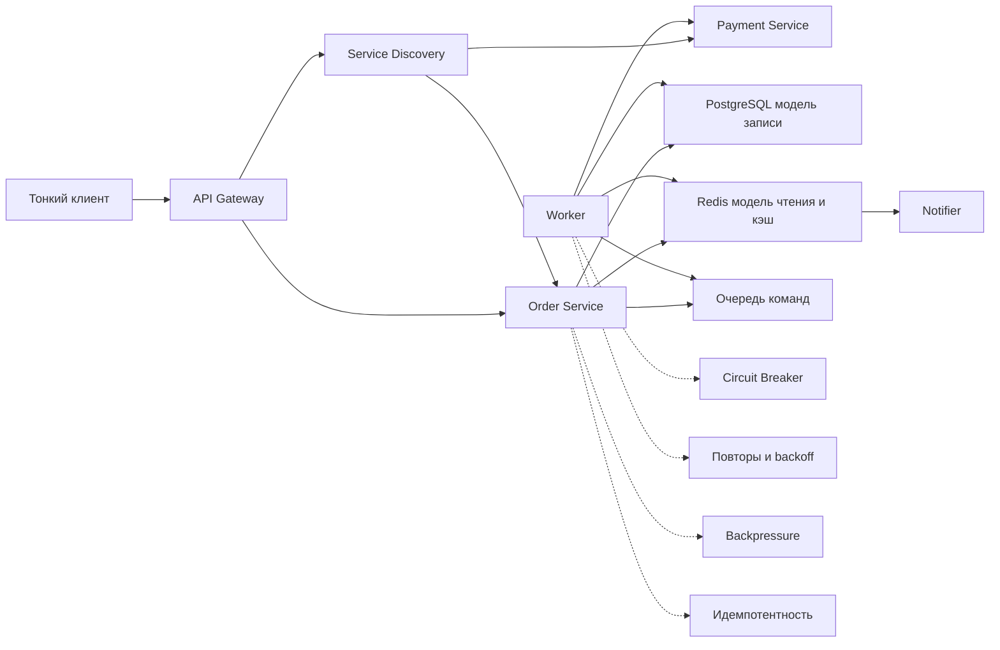

# Лабораторная работа 6

Проектирование web-системы с паттернами:

- трехзвенная архитектура;
- Service Discovery, Heartbeat, PubSub;
- CQRS, очередь команд, асинхронная обработка;
- надежность: retries, backoff, circuit breaker, idempotency, backpressure;
- способы получения статуса: polling, long polling, streaming.

## Пояснение по выполнению задания

### 1. Архитектура

Использована трехзвенная модель:

- `Client`: web/mobile клиент;
- `Backend`: API Gateway и прикладные сервисы;
- `Database`: PostgreSQL и Redis.

Тип клиента: **тонкий**. Бизнес-логика сосредоточена на backend, что упрощает контроль версий и безопасность.

### 2. Взаимодействие сервисов

- `Pub/Sub`: события статуса заказа и уведомления;
- `Service Discovery`: поиск актуальных адресов сервисов;
- `Heartbeat`: периодическое подтверждение живости инстансов.

### 3. Работа с данными

- `CQRS`: разделены write-модель (транзакционные данные) и read-модель (быстрые чтения);
- `MapReduce` для аналитики: map заказов по дню, reduce сумм/количеств.

### 4. Надежность

Реализованные паттерны:

- `Retries + Backoff` для временных ошибок;
- `Idempotency` для безопасных повторов запросов;
- `Circuit Breaker` для защиты от каскадных отказов;
- `Backpressure` для контроля перегрузки.

Обработка ошибок:

- `Fallback` на альтернативный путь обработки;
- `Graceful Degradation` со снижением функционала без полной остановки.

### 5. Кэширование

- версионирование кэша через версию/etag;
- тегирование кэша по сущности или пользователю для точечной инвалидции.

### 6. Асинхронность

- очередь сообщений для фоновых операций;
- отложенные задачи в worker-процессах.

### 7. Получение данных

- `Polling` для регулярной проверки;
- `Long Polling` для уменьшения лишних запросов;
- `Streaming` для near real-time обновлений.

### 8. Деплой

Описаны стратегии:

- `Rolling Release` — поэтапное обновление инстансов;
- `Blue/Green` — переключение между двумя окружениями;
- `Canary Release` — выпуск новой версии на долю трафика.

## Краткие ответы

- Паттерны выбраны для разделения ответственности, устойчивости и масштабируемости.
- Отказоустойчивость обеспечивается комбинацией retry/backoff, breaker, fallback и backpressure.
- Масштабирование достигается горизонтальным ростом сервисов, разделением read/write и выделением асинхронных worker-ов.

## Диаграмма Mermaid

Название: `Контейнерная диаграмма web-системы с отказоустойчивыми паттернами`

