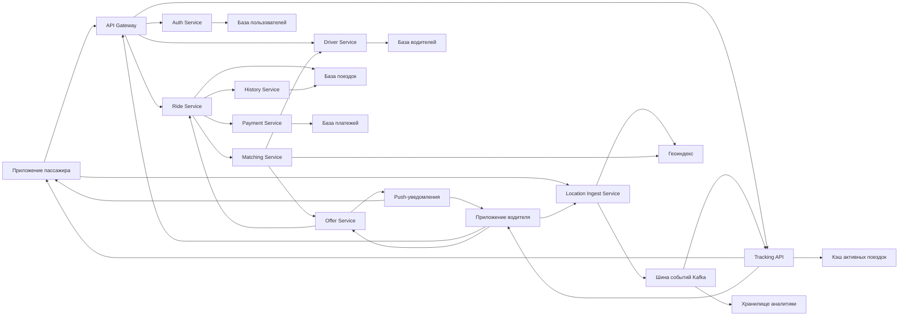

# Лабораторная работа 8

Проектирование системы уровня такси-сервиса:

- заказ поездки;
- подбор ближайшего водителя;
- подтверждение или отклонение заказа;
- realtime наблюдение за поездкой;
- история поездок;
- event-driven архитектура для высокой нагрузки.

## Пояснение по выполнению задания

### Функциональные требования

В проекте покрыты ключевые сценарии:

1. Заказ поездки пассажиром через `Ride Service`.
2. Начало/окончание смены и управление доступностью водителя через `Driver Service`.
3. Поиск ближайшего водителя через `Matching Service` и геоиндекс.
4. Подтверждение/отклонение оффера через `Offer Service`.
5. Наблюдение за поездкой в реальном времени через `Tracking API`.
6. Хранение и выдача истории поездок через `History Service`.

### Нефункциональные требования

При проектировании учтены вводные:

- `100 млн` пассажиров и `5 млн` водителей;
- в среднем `1` поездка в день на пассажира;
- средняя длительность `30 минут`;
- около `20` поездок в день на водителя;
- целевой отклик до `1 минуты` для жизненного цикла назначения;
- доступность уровня `95-99%`.

### Нагрузка и масштабирование

Принятые допущения дают высокий постоянный поток событий локации и операций назначения, поэтому архитектура разделена на:

- синхронный API-слой (`Gateway`, бизнес-сервисы);
- событийный слой (`Kafka`);
- слой геопоиска (`Geo Index`);
- хранилища операционных данных и аналитики.

Это позволяет масштабировать подсистемы независимо: отдельно API, отдельно трекинг/стримы, отдельно хранилища.

### Отказоустойчивость

Отказоустойчивость достигается через:

- декомпозицию по сервисам;
- асинхронное взаимодействие через шину событий;
- репликацию критичных хранилищ;
- деградационные сценарии (временная недоступность части функций без остановки заказа).

## Диаграмма Mermaid

Название: `Контейнерная диаграмма сервиса заказа такси`

