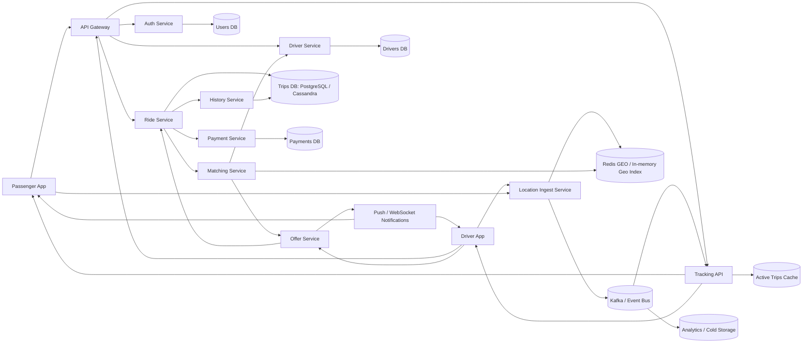

# Лабораторная работа 8

Тема: проектирование системы уровня Яндекс Такси.

Цель: спроектировать высокоуровневую архитектуру сервиса заказа такси, оценить нагрузку, память, хранилище и основные инфраструктурные решения.

## 1. Требования

### Функциональные требования

- Пользователь может заказать такси из точки A в точку B.
- Водитель может начать и закончить рабочую смену.
- Система подбирает ближайшего подходящего водителя для поездки.
- Водитель может подтвердить или отклонить заказ.
- Пользователь может наблюдать за поездкой в реальном времени.
- Пользователь и водитель могут смотреть историю поездок.

### Нефункциональные требования

- 100 млн пассажиров.
- 5 млн водителей.
- Каждый пассажир делает 1 поездку в день.
- Средняя продолжительность поездки: 30 минут.
- Каждый водитель делает 20 поездок в день.
- Response time на подбор/создание заказа: до 1 минуты.
- Доступность: 95-99% в год.

## 2. Основные сущности

- `Passenger`: пассажир.
- `Driver`: водитель.
- `DriverShift`: рабочая смена водителя.
- `Ride`: заказ/поездка.
- `Location`: координаты пользователя или водителя.
- `DriverOffer`: предложение заказа водителю.
- `Payment`: оплата поездки.
- `RideEvent`: событие поездки для истории и аналитики.

## 3. Диаграмма архитектуры

Mermaid-диаграмму можно вставить в Markdown-редактор, Mermaid Live Editor или использовать как основу для схемы в Miro.



## 4. Поток заказа такси

1. Пассажир отправляет `POST /rides` с точкой посадки и назначения.
2. `Ride Service` создает заказ в статусе `SEARCHING`.
3. `Matching Service` ищет ближайших свободных водителей через геоиндекс.
4. `Offer Service` отправляет предложение первому набору кандидатов.
5. Водитель подтверждает или отклоняет заказ.
6. Если водитель отклонил или не ответил за timeout, предложение уходит следующему кандидату.
7. После подтверждения заказ переходит в `ACCEPTED`.
8. Во время поездки `Location Ingest Service` принимает координаты и публикует события.
9. `Tracking API` отдает актуальное состояние поездки пассажиру и водителю.
10. После завершения поездка переходит в `COMPLETED` и сохраняется в истории.

## 5. Расчет нагрузки

### Поездки

Дано:

- 100 млн пассажиров.
- 1 поездка на пассажира в день.
- Значит, поездок в день: `100 000 000`.

Средняя нагрузка на создание поездок:

```text
100 000 000 / 86 400 секунд = 1 157 заказов/сек
```

Пиковая нагрузка обычно выше средней. Берем коэффициент пика `x5`:

```text
1 157 * 5 = 5 785 заказов/сек
```

Итого для сервиса заказов нужно проектировать примерно на `6 000 RPS` создания поездок в пике.

### Проверка емкости водителей

Дано:

- 5 млн водителей.
- 20 поездок в день на водителя.

```text
5 000 000 * 20 = 100 000 000 поездок/день
```

Емкость водителей совпадает со спросом: 100 млн поездок в день.

### Активные поездки

Средняя длительность поездки: 30 минут.

```text
100 000 000 поездок/день * 30 минут / 1 440 минут = 2 083 333 активных поездок
```

В среднем одновременно активно около `2.1 млн` поездок.

В пике можно ожидать `4-6 млн` активных поездок.

### Онлайн-водители

Один водитель делает 20 поездок по 30 минут:

```text
20 * 30 минут = 600 минут = 10 часов в поездках
```

Если добавить ожидание заказов и перерывы, примем среднюю смену `12 часов`.

```text
5 000 000 * 12 / 24 = 2 500 000 онлайн-водителей в среднем
```

В среднем онлайн около `2.5 млн` водителей, в пике `3-4 млн`.

### Геолокационные обновления

Пусть приложение водителя отправляет координаты раз в 5 секунд.

```text
2 500 000 онлайн-водителей / 5 секунд = 500 000 location updates/sec
```

Пассажиры в активных поездках тоже получают/могут отправлять обновления. Для 2.1 млн активных поездок:

```text
2 100 000 / 5 секунд = 420 000 updates/sec
```

Итого средняя нагрузка на геолокацию:

```text
500 000 + 420 000 = 920 000 updates/sec
```

В пике стоит проектировать `1.5-3 млн updates/sec`.

Это самая тяжелая часть системы, поэтому location-поток должен идти отдельно от обычного REST API.

## 6. Расчет хранилища

### Пользователи и водители

Пассажирский профиль, грубо `1 KB`:

```text
100 000 000 * 1 KB = 100 GB
```

Профиль водителя, документы, настройки, грубо `2 KB`:

```text
5 000 000 * 2 KB = 10 GB
```

Это небольшие объемы для основной БД, даже с индексами и репликацией.

### История поездок

Одна запись поездки: `2 KB` без детального трека.

```text
100 000 000 поездок/день * 2 KB = 200 GB/день
200 GB * 365 = 73 TB/год
```

С репликацией `x3`:

```text
73 TB * 3 = 219 TB/год
```

Историю поездок лучше хранить в шардированной БД или wide-column хранилище, например Cassandra/ScyllaDB. Горячие данные за последние месяцы можно держать отдельно от архивных.

### Треки поездок

Если хранить сжатый маршрут поездки примерно `10 KB` на поездку:

```text
100 000 000 * 10 KB = 1 TB/день
365 TB/год
```

С репликацией `x3`: около `1.1 PB/год`.

Поэтому сырые координаты нельзя бесконечно хранить в основной БД. Подход:

- последние 24-72 часа хранить в горячем хранилище;
- агрегированный маршрут хранить в истории поездки;
- сырые события складывать в cold storage с TTL или дешевой архивацией.

### Location events

Если одно событие координат после сериализации занимает `100 bytes`:

```text
920 000 events/sec * 100 bytes = 92 MB/sec
92 MB/sec * 86 400 = 7.9 TB/день
```

В пике поток может быть выше, поэтому location-события нужно обрабатывать через Kafka/Pulsar и хранить ограниченное время.

## 7. Расчет памяти

### Геоиндекс свободных водителей

В геоиндексе нужны только онлайн и свободные водители. Пусть в среднем таких `1.5 млн`.

Одна запись: driver_id, координаты, timestamp, статус, служебные структуры. Грубо `200 bytes` логических данных.

```text
1 500 000 * 200 bytes = 300 MB
```

С учетом overhead Redis/in-memory структур можно умножить на `5-10`:

```text
300 MB * 10 = 3 GB
```

Для надежности и шардирования закладываем `16-32 GB RAM` на кластер геоиндекса в одном регионе/крупном городе, плюс реплики.

### Активные поездки

Одно состояние активной поездки: `2 KB`.

```text
2 100 000 * 2 KB = 4.2 GB
```

С overhead и запасом: `16-32 GB RAM` для active trips cache.

### WebSocket/SSE соединения

Если одновременно наблюдают за поездками 2.1 млн пассажиров и 2.1 млн водителей:

```text
4.2 млн соединений
```

Если на одно соединение нужно примерно `10 KB` памяти:

```text
4 200 000 * 10 KB = 42 GB
```

С запасом и overhead: `100-150 GB RAM`, распределенные по множеству gateway/tracking-инстансов.

## 8. Подбор ближайшего водителя

Для быстрого поиска используется геоиндекс:

- Redis GEO, H3, S2 Geometry или собственный in-memory индекс.
- Мир делится на геоячейки.
- Каждый свободный водитель лежит в ячейке по текущим координатам.
- При заказе ищем водителей в ближайшей ячейке и соседних ячейках.
- Сначала отправляем offer 5-10 ближайшим подходящим водителям.
- Если никто не принял, расширяем радиус поиска.

Пример стратегии:

```text
0-10 секунд: радиус 1 км, до 5 водителей
10-25 секунд: радиус 3 км, до 10 водителей
25-45 секунд: радиус 5 км, до 20 водителей
45-60 секунд: fallback, повышенный радиус или сообщение пользователю
```

Так выполняется требование response time до 1 минуты.

## 9. API

### Пассажир

```http
POST /rides
GET /rides/{ride_id}
GET /rides/{ride_id}/track
GET /users/{user_id}/rides
```

### Водитель

```http
POST /drivers/{driver_id}/shift/start
POST /drivers/{driver_id}/shift/end
POST /drivers/{driver_id}/location
POST /offers/{offer_id}/accept
POST /offers/{offer_id}/reject
GET /drivers/{driver_id}/rides
```

## 10. Выбор хранилищ

- PostgreSQL: пользователи, водители, платежи, критичные транзакционные данные.
- Cassandra/ScyllaDB: история поездок с большим объемом записей.
- Redis Cluster: геоиндекс, активные поездки, короткоживущий cache.
- Kafka/Pulsar: поток координат, события поездок, асинхронная обработка.
- S3/объектное хранилище: архив координат, аналитика, долгосрочные данные.

## 11. Масштабирование

- `API Gateway` масштабируется горизонтально.
- `Ride Service` масштабируется по RPS создания и чтения заказов.
- `Location Ingest Service` масштабируется отдельно, так как получает до миллионов событий в секунду.
- `Matching Service` масштабируется по городам/регионам.
- Геоиндекс шардируется по географическим зонам.
- История поездок шардируется по `user_id`, `driver_id` или `ride_id`.
- Kafka топики партиционируются по `city_id` или `ride_id`.

## 12. Надежность и доступность

Требуемая доступность 95-99% означает допустимый простой в год:

```text
95%  -> до 18.25 дней простоя/год
99%  -> до 3.65 дней простоя/год
99.9% -> до 8.76 часов простоя/год
```

Для 95-99% достаточно:

- несколько инстансов каждого stateless-сервиса;
- health checks и автоматический restart;
- репликация БД;
- Kafka с replication factor 3;
- Redis Cluster с репликами;
- graceful degradation.

Graceful degradation:

- если история недоступна, заказ такси все равно работает;
- если платежный сервис временно недоступен, поездку можно завершить с последующим списанием;
- если realtime tracking деградировал, показываем последнюю известную позицию;
- если matching перегружен, ограничиваем радиус/частоту поиска и ставим backpressure.

## 13. Компромиссы

- Сильная консистентность нужна для статуса поездки и оплаты.
- Eventual consistency допустима для трекинга, истории и аналитики.
- Сырые координаты слишком дорогие для вечного хранения, поэтому нужен TTL и агрегация маршрутов.
- Matching лучше держать региональным, чтобы сбой в одном городе не ломал всю систему.
- Response time 1 минута позволяет делать несколько волн предложений водителям, а не искать идеального водителя синхронно.

## 14. Краткий итог

Система выдерживает расчетную нагрузку за счет разделения потоков:

- обычные пользовательские запросы: около `6 000 RPS` в пике на создание заказов;
- realtime location: до `1.5-3 млн events/sec` в пике;
- активные поездки: `2-6 млн` одновременно;
- история поездок: около `73 TB/год` без маршрутов и до `1 PB/год` с детальными треками и репликацией.

Главная идея архитектуры: REST/gRPC-сервисы обслуживают бизнес-операции, Kafka принимает тяжелый поток событий, Redis/In-memory GEO отвечает за быстрый matching, а история и аналитика уходят в шардированные и архивные хранилища.
