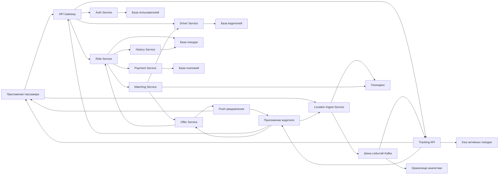

# Лабораторная работа 8

Проектирование системы уровня такси-сервиса:

- заказ поездки;
- подбор ближайшего водителя;
- подтверждение или отклонение заказа;
- realtime наблюдение за поездкой;
- история поездок;
- event-driven архитектура для высокой нагрузки.

## Пояснение по выполнению задания

### Функциональные требования

В проекте покрыты ключевые сценарии:

1. Заказ поездки пассажиром через `Ride Service`.
2. Начало/окончание смены и управление доступностью водителя через `Driver Service`.
3. Поиск ближайшего водителя через `Matching Service` и геоиндекс.
4. Подтверждение/отклонение оффера через `Offer Service`.
5. Наблюдение за поездкой в реальном времени через `Tracking API`.
6. Хранение и выдача истории поездок через `History Service`.

### Нефункциональные требования

При проектировании учтены вводные:

- `100 млн` пассажиров и `5 млн` водителей;
- в среднем `1` поездка в день на пассажира;
- средняя длительность `30 минут`;
- около `20` поездок в день на водителя;
- целевой отклик до `1 минуты` для жизненного цикла назначения;
- доступность уровня `95-99%`.

### Нагрузка и масштабирование

Принятые допущения дают высокий постоянный поток событий локации и операций назначения, поэтому архитектура разделена на:

- синхронный API-слой (`Gateway`, бизнес-сервисы);
- событийный слой (`Kafka`);
- слой геопоиска (`Geo Index`);
- хранилища операционных данных и аналитики.

Это позволяет масштабировать подсистемы независимо: отдельно API, отдельно трекинг/стримы, отдельно хранилища.

### Расчёт нагрузки и ресурсов

#### Входные данные

| Параметр | Значение |
|---|---|
| Пассажиров | 100 млн |
| Водителей | 5 млн |
| Поездок на пассажира в день | 1 |
| Поездок на водителя в день | 20 |
| Средняя длительность поездки | 30 мин |
| Целевой отклик | < 1 мин |

#### QPS (запросы в секунду)

**Заказы поездок:**

- 100M поездок / 86 400 с ≈ **1 160 req/s** (среднее).
- Пиковые часы (утро, вечер) дают 3–4× от среднего → **~4 000 req/s** в пик.

**Активные поездки одновременно:**

- Если поездки распределены равномерно: 100M × (30 / 1440) ≈ **2.1 млн** поездок одновременно.
- С учётом пиковых часов (3–5×): **6–10 млн** активных поездок в пик.

**Обновления локации:**

- Онлайн одновременно: 5M водителей × 60% (пик) = **3 млн** водителей.
- Частота обновления: 1 раз / 5–10 с → **300K–600K events/s**.
- В пик: до **1M events/s**.

**Сводная таблица QPS:**

| Поток | Среднее | Пик |
|---|---|---|
| Заказы поездок | ~1 200 req/s | ~4 000 req/s |
| Location-события | ~300K events/s | ~1M events/s |
| Matching-запросы | ~1 200 req/s | ~4 000 req/s |
| Push-уведомления | ~2 400 req/s | ~8 000 req/s |

#### Хранилище (storage)

| Сущность | Записи/год | Размер записи | Объём/год |
|---|---|---|---|
| Поездки | 36.5 млрд | ~1 KB | ~36 TB |
| Водители | 5 млн | ~1 KB | ~5 MB |
| Пользователи | 100 млн | ~0.5 KB | ~50 MB |
| Платежи | 36.5 млрд | ~0.5 KB | ~18 TB |

- С учётом сжатия и холодного хранения (архив старше 90 дней): **~10–15 TB/год** для горячих данных.
- Полная история (без удаления): **~55 TB/год**.

#### Память (RAM / кэш)

| Компонент | Расчёт | Объём |
|---|---|---|
| Кэш активных поездок (Redis) | 10M × 2 KB | **~20 GB** |
| Геоиндекс (RAM) | 5M водителей × 200 B | **~1 GB** |
| Кэш профилей водителей | 5M × 1 KB | **~5 GB** |
| Кэш профилей пассажиров | 100M × 0.5 KB (hot subset 10%) | **~5 GB** |
| **Итого кэш (Redis/Geo)** | | **~30 GB** |

#### Пропускная способность Kafka

| Топик | Throughput |
|---|---|
| `location-events` | ~1M msgs/s × 200 B = **~200 MB/s** (~1.6 Gbps) |
| `ride-events` | ~4K msgs/s × 1 KB = **~4 MB/s** |
| `driver-events` | ~10K msgs/s × 0.5 KB = **~5 MB/s** |
| **Итого** | **~210 MB/s** (~1.7 Gbps) |

- Требуется **3+ Kafka-брокера** с сетевым интерфейсом ≥ 10 Gbps.

#### Пропускная способность сеть (API Gateway)

| Поток | Трафик |
|---|---|
| Исходящие API-ответы | ~4K req/s × 5 KB = **~20 MB/s** |
| Исходящие push-уведомления | ~8K req/s × 0.5 KB = **~4 MB/s** |
| Входящие location-пакеты | ~1M × 200 B = **~200 MB/s** |
| **Итого Gateway** | **~224 MB/s** (~1.8 Gbps) |

#### Масштабирование компонентов

| Компонент | Мин. инстансы | Причина |
|---|---|---|
| API Gateway | 3+ | Горизонтальное масштабирование, балансировка |
| Ride Service | 5+ | ~4K req/s, каждый инстанс обрабатывает ~1K |
| Matching Service | 5+ | CPU-bound (геопоиск), параллелизация |
| Location Ingest | 10+ | ~1M events/s, самый нагруженный компонент |
| Kafka | 3+ брокера | ~200 MB/s, replication factor ≥ 2 |
| PostgreSQL (поездки) | Primary + 2 replicas | Запись в primary, чтение из replicas |
| Redis (кэш) | 3+ ноды (cluster) | ~30 GB, failover |
| Geo Index | 3+ ноды | Отказоустойчивость геопоиска |

### Отказоустойчивость

Отказоустойчивость достигается через:

- декомпозицию по сервисам;
- асинхронное взаимодействие через шину событий;
- репликацию критичных хранилищ;
- деградационные сценарии (временная недоступность части функций без остановки заказа).

## Диаграмма Mermaid

Название: `Контейнерная диаграмма сервиса заказа такси`

