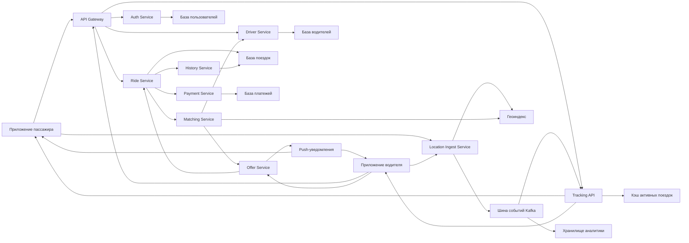
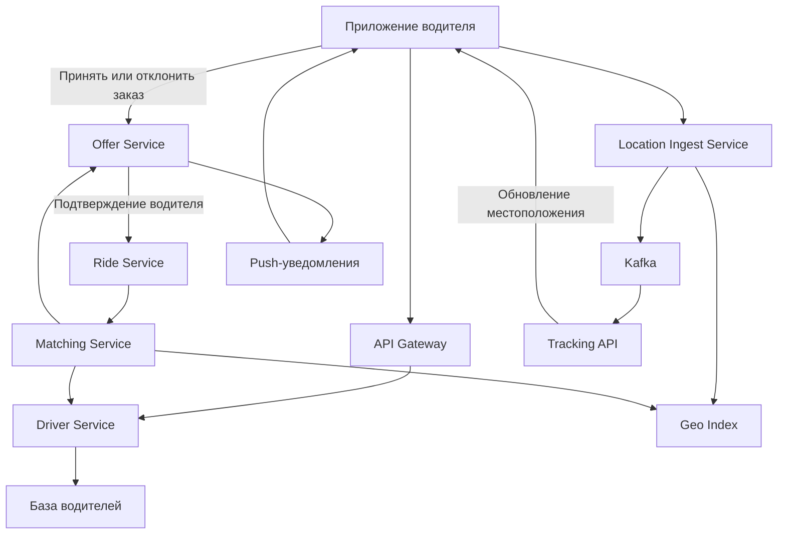
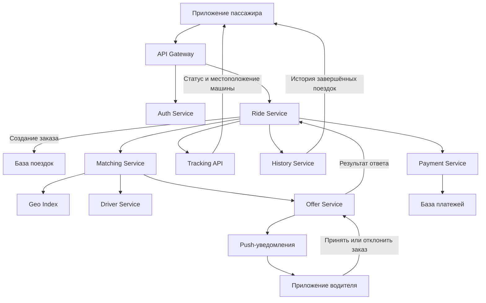

# Лабораторная работа 8

## Тема

Проектирование высоконагруженного сервиса заказа такси.

В этой лабораторной рассматривается система уровня крупного такси-сервиса, где нужно:

- принять заказ от пассажира;
- найти ближайшего водителя;
- получить подтверждение или отказ от водителя;
- показывать поездку в реальном времени;
- хранить историю поездок;
- выдерживать высокую нагрузку.

## Что должна уметь система

Система должна поддерживать такие сценарии:

1. Пассажир создаёт заказ.
2. Водитель выходит на линию и завершает смену.
3. Сервис находит ближайшего подходящего водителя.
4. Водитель принимает или отклоняет заказ.
5. Пассажир и водитель могут следить за поездкой в реальном времени.
6. Пользователь может посмотреть историю своих поездок.

## Исходные данные

При проектировании использованы такие вводные:

- `100 млн` пассажиров;
- `5 млн` водителей;
- в среднем `1 поездка в день` на пассажира;
- в среднем `20 поездок в день` на водителя;
- средняя длительность поездки `30 минут`;
- время на назначение водителя `до 1 минуты`;
- доступность системы `95–99%`.

## Почему выбрана такая архитектура

Для такой системы недостаточно одного большого приложения. Нагрузка слишком разная:

- есть обычные бизнес-запросы: создать заказ, подтвердить поездку, посмотреть историю;
- есть очень частые события геолокации от водителей;
- есть вычислительно тяжёлая задача поиска ближайшего водителя.

Поэтому система разделена на несколько частей, и у каждой части своя понятная зона ответственности:

- `API Gateway` принимает внешние запросы от приложений пассажира и водителя. Он выступает как единая точка входа: проверяет запросы, перенаправляет их в нужные сервисы и скрывает внутреннюю структуру системы от клиента.
- `Ride Service` управляет жизненным циклом поездки. Через него создаётся заказ, меняется его статус, сохраняются основные данные о маршруте и состоянии поездки.
- `Driver Service` хранит информацию о водителях: доступен ли водитель, вышел ли он на линию, может ли он принять новый заказ. Это отдельный сервис, потому что состояние водителей меняется независимо от самих поездок.
- `Matching Service` занимается подбором ближайшего подходящего водителя. Это отдельный вычислительный блок, потому что поиск по геоданным требует своей логики и может сильно нагружать процессор.
- `Offer Service` отправляет найденному водителю предложение взять заказ и ждёт ответ. Такой шаг вынесен отдельно, чтобы не смешивать бизнес-логику заказа с логикой подтверждения или отказа.
- `Tracking API` нужен для наблюдения за поездкой в реальном времени. Он получает актуальные координаты и отдаёт их клиентским приложениям, чтобы пассажир и водитель видели движение на карте.
- `History Service` отвечает за выдачу истории поездок. Он отделён от основного сервиса заказов, потому что просмотр старых поездок не должен мешать созданию новых заказов.
- `Location Ingest Service` принимает огромный поток координат от водителей. Это один из самых нагруженных компонентов, поэтому его лучше выделять отдельно и масштабировать независимо от остальных сервисов.
- `Kafka` используется как шина событий. Она помогает не передавать все данные напрямую между сервисами, а отправлять события через очередь. Это снижает связанность и помогает системе переживать пики нагрузки.
- `Redis / Geo Index` хранит горячие данные в памяти: активные поездки и геопозиции, нужные для быстрого поиска. Без такого слоя система была бы слишком медленной, если бы каждый раз обращалась только к основной базе.

Такое разделение позволяет масштабировать части системы отдельно друг от друга. Например, при росте числа заказов можно добавить инстансы `Ride Service`, при росте потока координат увеличить `Location Ingest Service`, а при более сложном подборе водителей масштабировать `Matching Service`. В результате ресурсы распределяются точнее, а вся система работает стабильнее.

## Оценка нагрузки

### Заказы

Если `100 млн` пассажиров совершают в среднем `1 поездку в день`, получаем:

- `100 000 000 / 86 400 ≈ 1 160 req/s` в среднем;
- в часы пик нагрузка может вырасти примерно до `4 000 req/s`.

### Активные поездки

Если средняя поездка длится `30 минут`, то одновременно в системе может быть:

- около `2.1 млн` активных поездок при равномерной нагрузке;
- до `6–10 млн` в часы пик.

### Геолокация водителей

Если онлайн одновременно находятся около `60%` водителей, это:

- `5 млн × 60% = 3 млн` водителей.

Если координаты отправляются раз в `5–10 секунд`, то получается:

- `300K–600K events/s` в обычной ситуации;
- до `1M events/s` в пик.

### Сводная таблица

| Поток | Средняя нагрузка | Пиковая нагрузка |
|---|---|---|
| Заказы поездок | ~1 200 req/s | ~4 000 req/s |
| События геолокации | ~300K events/s | ~1M events/s |
| Запросы на подбор водителя | ~1 200 req/s | ~4 000 req/s |
| Push-уведомления | ~2 400 req/s | ~8 000 req/s |

## Оценка хранилищ

### Данные за год

| Сущность | Объём |
|---|---|
| Поездки | ~36 TB/год |
| Платежи | ~18 TB/год |
| Полная история данных | ~55 TB/год |

Чтобы не держать весь объём в горячем хранилище, старые данные можно переносить в архив. Тогда в рабочем слое останется примерно `10–15 TB` в год.

### Память и кэш

Для быстрой работы часть данных нужно хранить в памяти:

| Компонент | Примерный объём |
|---|---|
| Кэш активных поездок | ~20 GB |
| Геоиндекс | ~1 GB |
| Кэш профилей водителей | ~5 GB |
| Кэш активных профилей пассажиров | ~5 GB |
| Итого | ~30 GB |

## Kafka и сеть

### Kafka

Основная нагрузка на Kafka идёт от событий геолокации:

- `location-events`: до `~200 MB/s`;
- `ride-events`: около `~4 MB/s`;
- `driver-events`: около `~5 MB/s`.

Суммарно это примерно `~210 MB/s`, поэтому нужен кластер минимум из `3` брокеров.

### Сеть

Примерная нагрузка на сетевой контур:

- ответы API: `~20 MB/s`;
- push-уведомления: `~4 MB/s`;
- входящие пакеты с координатами: `~200 MB/s`.

Итого: около `~224 MB/s`.

## Масштабирование

Минимальная схема масштабирования может быть такой:

| Компонент | Минимум |
|---|---|
| API Gateway | 3+ инстанса |
| Ride Service | 5+ инстансов |
| Matching Service | 5+ инстансов |
| Location Ingest | 10+ инстансов |
| Kafka | 3+ брокера |
| PostgreSQL | 1 primary + 2 replicas |
| Redis | 3+ ноды |
| Geo Index | 3+ ноды |

Причины такие:

- `API Gateway` должен выдерживать много одновременных подключений;
- `Ride Service` и `Matching Service` нужно масштабировать горизонтально;
- `Location Ingest` получает самый тяжёлый поток событий;
- `Kafka`, `Redis` и `Geo Index` должны быть отказоустойчивыми.

## Отказоустойчивость

Система должна продолжать работать даже при сбоях отдельных частей. Для этого используются:

- разделение на независимые сервисы;
- асинхронное взаимодействие через `Kafka`;
- репликация баз данных и кэша;
- сценарии деградации, когда второстепенные функции могут временно работать хуже, но основной сценарий заказа остаётся доступным.

Например, если временно недоступен сервис истории, пользователь всё равно должен иметь возможность заказать поездку.

## Итоговое архитектурное решение

Для сервиса такси выбрана `микросервисная event-driven архитектура`, потому что она лучше всего подходит под такие условия:

- очень много пользователей;
- высокий поток событий геолокации;
- необходимость независимо масштабировать разные части системы;
- требования к отказоустойчивости;
- необходимость быстро обрабатывать и запросы, и потоковые события.

## Общая диаграмма системы

```mermaid
flowchart LR
    P["Приложение пассажира"] --> GW["API Gateway"]
    D["Приложение водителя"] --> GW

    GW --> AUTH["Auth Service"]
    GW --> RIDE["Ride Service"]
    GW --> DRIVER["Driver Service"]
    GW --> TRACK["Tracking API"]

    P --> LOC["Location Ingest Service"]
    D --> LOC
    LOC --> BUS["Шина событий Kafka"]
    LOC --> GEO["Геоиндекс"]

    RIDE --> MATCH["Matching Service"]
    MATCH --> GEO
    MATCH --> DRIVER
    MATCH --> OFFER["Offer Service"]
    OFFER --> PUSH["Push-уведомления"]
    PUSH --> P
    PUSH --> D

    D --> OFFER
    OFFER --> RIDE

    RIDE --> TRIPDB["База поездок"]
    DRIVER --> DRIVERDB["База водителей"]
    AUTH --> USERDB["База пользователей"]

    BUS --> TRACK
    TRACK --> ACTIVE["Кэш активных поездок"]
    TRACK --> P
    TRACK --> D

    RIDE --> HIST["History Service"]
    HIST --> TRIPDB

    RIDE --> PAY["Payment Service"]
    PAY --> PAYDB["База платежей"]
    BUS --> ANALYTICS["Хранилище аналитики"]
```

Эта диаграмма показывает общую архитектуру сервиса такси и то, как между собой связаны основные части системы. Сверху находятся два клиента: приложение пассажира и приложение водителя. Они не работают напрямую с внутренними сервисами, а обращаются в `API Gateway`. Это единая точка входа в систему. Такой подход удобен тем, что клиентам не нужно знать внутреннюю структуру системы: они отправляют запрос в одно место, а дальше gateway уже сам решает, в какой сервис его передать.

`Ride Service` отвечает за саму поездку как за бизнес-сущность. Через него создаётся заказ, меняется статус поездки, фиксируется назначение водителя, начало поездки и её завершение. По сути, это центральный сервис предметной области, потому что именно вокруг поездки строится основной сценарий работы системы.

`Driver Service` хранит состояние водителей. Он знает, какой водитель сейчас на линии, кто свободен, кто уже занят, кто может принять новый заказ, а кто нет. Эти данные нужны `Matching Service`, потому что мало просто найти ближайшую машину по координатам, нужно ещё понять, можно ли вообще назначить этого водителя на заказ.

`Matching Service` занимается подбором водителя. Когда появляется новый заказ, именно этот сервис ищет, какая машина лучше всего подходит пассажиру. Для этого он использует данные о местоположении из `Geo Index` и состояние водителя из `Driver Service`. Такой сервис вынесен отдельно, потому что логика подбора может быть сложной: учитывать расстояние, загрузку, тариф, район, рейтинг водителя и другие параметры.

`Offer Service` нужен для обработки оффера, то есть предложения водителю взять заказ. После того как `Matching Service` нашёл кандидата, `Offer Service` отправляет предложение и ждёт ответ. Это отдельный шаг, потому что между поиском водителя и фактическим назначением проходит бизнес-процесс: водитель может согласиться, отказаться или вообще не ответить вовремя.

Отдельно на диаграмме показан `Location Ingest Service`. Он принимает поток координат от приложений водителей. Этот сервис вынесен отдельно, потому что поток геоданных очень большой и по нагрузке сильно отличается от обычных бизнес-запросов. Если смешать его с логикой заказов, то постоянные координаты начнут мешать основным операциям системы.

Дальше координаты попадают в `Kafka` и `Geo Index`. `Kafka` играет роль шины событий: через неё сервисы обмениваются сообщениями и получают обновления асинхронно. Это значит, что системе не нужно, чтобы все компоненты отвечали друг другу мгновенно и напрямую. Такой подход повышает устойчивость и помогает переживать пики нагрузки. `Geo Index` нужен для быстрого геопоиска. Он хранит актуальные координаты так, чтобы можно было быстро найти ближайшие машины без тяжёлых запросов к основной базе.

`Tracking API` использует события и актуальные координаты, чтобы показывать движение машины в реальном времени. Благодаря этому пассажир может видеть, где находится водитель, а водитель может работать с текущим статусом поездки. Для быстрых операций используется `Кэш активных поездок`, потому что активные поездки меняются постоянно и должны читаться без задержек.

Ниже также показаны сервисы хранения и вспомогательной логики. `History Service` отвечает за историю поездок и позволяет не нагружать основной сервис заказов старыми данными. `Payment Service` выделен отдельно, потому что платежи тоже являются отдельной бизнес-областью и не должны смешиваться с основной логикой назначения поездки. `Хранилище аналитики` получает события из `Kafka` и может использоваться для отчётов, статистики и анализа поведения системы.

Главная идея этой схемы в том, что система разделена на независимые блоки по зонам ответственности. Это позволяет масштабировать не всё приложение сразу, а только те компоненты, на которые реально выросла нагрузка. Например, если увеличился поток координат, можно усиливать `Location Ingest Service`, не трогая `Ride Service`. Если выросло число заказов, можно отдельно масштабировать `Ride Service` и `Matching Service`.

## Диаграмма для водителя

Ниже показан основной сценарий со стороны водителя: выход на линию, получение заказа, подтверждение поездки и передача координат.

```mermaid
flowchart TD
    D["Приложение водителя"] --> GW["API Gateway"]
    D --> LOC["Location Ingest Service"]

    GW --> DRIVER["Driver Service"]
    DRIVER --> DRIVERDB["База водителей"]

    LOC --> BUS["Kafka"]
    LOC --> GEO["Geo Index"]

    RIDE["Ride Service"] --> MATCH["Matching Service"]
    MATCH --> GEO
    MATCH --> DRIVER
    MATCH --> OFFER["Offer Service"]

    OFFER --> PUSH["Push-уведомления"]
    PUSH --> D

    D -->|"Принять или отклонить заказ"| OFFER
    OFFER -->|"Подтверждение водителя"| RIDE

    BUS --> TRACK["Tracking API"]
    TRACK -->|"Обновление местоположения"| D
```

Эта диаграмма показывает полный путь водителя внутри системы, начиная с момента, когда он открывает приложение, и заканчивая работой с активной поездкой. Сначала водитель заходит в приложение, а приложение обращается в `API Gateway`. Через gateway запросы передаются в `Driver Service`, который отвечает за рабочее состояние водителя. Именно здесь фиксируется, что водитель вышел на линию, свободен ли он сейчас и может ли принимать новые заказы.

После выхода на линию водительское приложение начинает регулярно отправлять координаты в `Location Ingest Service`. Это важный момент: геолокация приходит не один раз, а постоянно, с небольшим интервалом. Поэтому для неё выделен отдельный поток обработки. `Location Ingest Service` быстро принимает координаты, а затем передаёт их дальше в `Kafka` и `Geo Index`.

`Kafka` здесь нужна для надёжной доставки событий другим частям системы. Даже если какой-то сервис временно недоступен, события могут не потеряться, а дождаться обработки. `Geo Index` нужен для мгновенного геопоиска. Благодаря ему система в любой момент знает, где находится водитель, и может использовать его координаты при поиске ближайшей машины для пассажира.

Когда пассажир создаёт новый заказ, `Ride Service` запускает процесс подбора водителя. Для этого он обращается к `Matching Service`. `Matching Service` смотрит на данные в `Geo Index`, проверяет информацию о состоянии водителя через `Driver Service` и выбирает подходящего кандидата. После этого он передаёт результат в `Offer Service`.

`Offer Service` отправляет водителю push-уведомление с предложением взять заказ. На этом этапе водитель видит новый заказ в приложении и должен принять решение. Он может согласиться на поездку или отказаться от неё. Этот ответ возвращается обратно в `Offer Service`, а затем передаётся в `Ride Service`.

После получения ответа `Ride Service` обновляет состояние заказа. Если водитель согласился, поездка закрепляется за ним. Если водитель отказался, система может перейти к следующему кандидату. Такой подход позволяет отделить логику поиска водителя от логики подтверждения заказа.

Когда поездка уже назначена и активна, водитель продолжает отправлять координаты. Эти данные используются `Tracking API`, чтобы система могла показывать актуальное местоположение машины и обновлять статус поездки в реальном времени. То есть после назначения водителя поток геоданных не прекращается: он нужен уже не для подбора, а для сопровождения поездки.

## Диаграмма для пассажира

Ниже показан основной сценарий со стороны пассажира: создание заказа, подбор водителя, получение подтверждения и наблюдение за поездкой.

```mermaid
flowchart TD
    P["Приложение пассажира"] --> GW["API Gateway"]
    GW --> AUTH["Auth Service"]
    GW --> RIDE["Ride Service"]

    RIDE -->|"Создание заказа"| TRIPDB["База поездок"]
    RIDE --> MATCH["Matching Service"]

    MATCH --> GEO["Geo Index"]
    MATCH --> DRIVER["Driver Service"]
    MATCH --> OFFER["Offer Service"]

    OFFER --> PUSH["Push-уведомления"]
    PUSH --> D["Приложение водителя"]

    D -->|"Принять или отклонить заказ"| OFFER
    OFFER -->|"Результат ответа"| RIDE

    RIDE --> TRACK["Tracking API"]
    TRACK -->|"Статус и местоположение машины"| P

    RIDE --> HIST["History Service"]
    HIST -->|"История завершённых поездок"| P

    RIDE --> PAY["Payment Service"]
    PAY --> PAYDB["База платежей"]
```

Эта диаграмма показывает сценарий со стороны пассажира, то есть как система обрабатывает заказ от момента его создания до завершения поездки. Сначала пассажир открывает приложение и отправляет запрос через `API Gateway`. Через gateway запрос поступает в `Ride Service`. Именно этот сервис создаёт новую поездку, сохраняет её в базе и запускает дальнейший процесс назначения водителя.

После создания заказа `Ride Service` передаёт задачу в `Matching Service`. На этом этапе система должна найти наиболее подходящего водителя. Для поиска используются данные из `Geo Index`, где лежат актуальные координаты машин, и данные из `Driver Service`, где хранится информация о доступности водителей. То есть сервис подбора учитывает не только расстояние, но и то, может ли водитель вообще взять заказ.

Когда подходящий водитель найден, управление переходит в `Offer Service`. Этот сервис отправляет водителю предложение через push-уведомление. Здесь важно понимать, что водитель назначается не сразу: сначала ему нужно отправить оффер и дождаться ответа. Это позволяет системе корректно обрабатывать ситуации, когда водитель не отвечает или отказывается от поездки.

Если водитель принимает заказ, `Offer Service` передаёт результат обратно в `Ride Service`, и поездка получает подтверждённый статус. Если водитель отказывается, система может запустить повторный подбор. Для пассажира это выглядит как процесс ожидания назначения машины, но внутри системы в этот момент происходит отдельный цикл выбора и подтверждения водителя.

После того как заказ подтверждён, пассажир может следить за машиной через `Tracking API`. Этот сервис получает актуальные координаты и показывает, где находится водитель и как продвигается поездка. Таким образом, пассажир видит не только сам факт назначения машины, но и весь дальнейший путь в реальном времени.

Когда поездка заканчивается, информация о ней сохраняется как завершённая и становится доступна через `History Service`. Это нужно для просмотра прошлых поездок, чеков и данных о маршруте. Если в системе используется безналичная оплата, то после завершения или в процессе поездки подключается `Payment Service`, который обрабатывает платёж отдельно от основной логики заказа. Такое разделение делает архитектуру чище и уменьшает риск того, что проблемы в оплате повлияют на создание и выполнение поездок.
